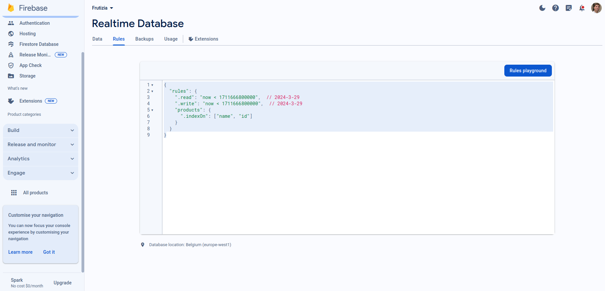

# Documentación de Frutizia

¡Bienvenidos/as a Frutizia! Tu destino fresco y saludable para comprar frutas y verduras de la mejor calidad desde la comodidad de tu hogar. Esta documentación te guiará a través de las características principales de nuestra aplicación web, diseñada para hacer tu experiencia de compra lo más fácil y agradable posible.

En algunos casos notarás que hay palabras técnicas. No te asustes, que es una documentación tanto para usuarios como desarrolladores.

## Funcionalidades principales

### 1. Registro y autenticación

- **Registro de usuarios:** Únete a la comunidad de Frutizia creando una cuenta con tu dirección de correo electrónico y una contraseña segura.
- **Inicio de sesión:** Accede a tu cuenta con facilidad utilizando tus credenciales registradas. ¡No pierdas tu contraseña?

#### <span style="font-size: 16px;">Explicación detallada del registro y autenticación</span> 

<span style="font-size: 14px;">En esta sección, se detalla cómo se implementan las pantallas de registro y autenticación de usuarios, así como la gestión de la sesión del usuario en la base de datos de Frutizia y local del propio móvil/celular (¡para no tener que loguearte todo el tiempo!).</span>


##### <span style="font-size: 14px;">Registro (`Register.js`):</span>

<span style="font-size: 14px;">El archivo `Register.js` maneja la pantalla de registro de usuarios. 

Algunos aspectos destacados a nivel de desarrollo incluyen:</span>

- <span style="font-size: 14px;">Utiliza componentes como `InputForm` y `SubmitButton` para recoger la información del usuario a medida que escribe su información.</span>
- <span style="font-size: 14px;">Realiza validaciones en los campos del registro antes de enviar los datos al servidor.</span>
- <span style="font-size: 14px;">Utiliza Redux para manejar el estado global de la aplicación y actualizar la información del usuario después del registro.</span>
- <span style="font-size: 14px;">Utiliza SQLite para almacenar la sesión del usuario en el dispositivo local a fin de evitar que tengas que volver a loguearte (el `MainNavigator.js` tiene una función que revisa el tiempo de conexión desde el último logueo y establece una caducidad de tus credenciales -token- de 1 hora, 3600 segundos).</span>

##### <span style="font-size: 14px;">Autenticación (`Login.js`):</span>

<span style="font-size: 14px;">El archivo `Login.js` maneja la pantalla de inicio de sesión de los usuarios. 

Sus características principales son:</span>

- <span style="font-size: 14px;">Utiliza componentes similares al archivo de Registro (`InputForm` y `SubmitButton`) para recoger la información del usuario.</span>
- <span style="font-size: 14px;">Utiliza Redux para manejar el estado global de la aplicación y actualizar la información del usuario después de la autenticación.</span>
- <span style="font-size: 14px;">Utiliza SQLite para almacenar la sesión del usuario en el dispositivo local.</span>
- <span style="font-size: 14px;">Posee un modal en caso de que la respuesta del servidor no sea 200 (ok).</span>

##### <span style="font-size: 14px;">Base de datos (`index.js`):</span>

<span style="font-size: 14px;">El archivo `index.js` define las funciones para inicializar, insertar, obtener y eliminar la sesión del usuario en la base de datos SQLite. 

Sus funciones principales son:</span>

- <span style="font-size: 14px;">`init`: Inicializa la base de datos SQLite.</span>
- <span style="font-size: 14px;">`insertSession`: Inserta la sesión del usuario en la base de datos.</span>
- <span style="font-size: 14px;">`fetchSession`: Obtiene la sesión del usuario de la base de datos.</span>
- <span style="font-size: 14px;">`deleteSession`: Elimina la sesión del usuario de la base de datos.</span>

##### <span style="font-size: 14px;">Modal de mensajes (`ModalMessage.js`):</span>

<span style="font-size: 14px;">El archivo `ModalMessage.js` define un componente reutilizable de modal para mostrar mensajes al usuario. 

Sus características principales son:</span>

- <span style="font-size: 14px;">Se utiliza para mostrar mensajes de error o éxito después de realizar acciones como el registro o la autenticación.</span>
- <span style="font-size: 14px;">También se utiliza para mostrar detalles de pedidos en la aplicación.</span>


### 2. Explora y compra en el mercado

- **Catálogo de productos:** Explora nuestra amplia selección de frutas y verduras frescas, organizadas de manera intuitiva para facilitar tu búsqueda.
- **Detalles del producto:** Obtén información detallada sobre cada producto.
- **Añadir al carro:** Agrega tus productos favoritos al carro de compra con un solo click.

#### <span style="font-size: 16px;">Explicación detallada</span> 

##### <span style="font-size: 14px;">Gestión de Carro</span>

<span style="font-size: 14px;">En esta sección, se detalla cómo se implementan las funcionalidades relacionadas con el carro de compra, incluyendo la visualización de productos, la finalización de la compra y la gestión del estado del carro.</span>

##### <span style="font-size: 14px;">Pantalla del carro (`Cart.js`):</span>

<span style="font-size: 14px;">El archivo `Cart.js` maneja la pantalla del carro de compra. 

Algunos aspectos destacados incluyen:</span>

- <span style="font-size: 14px;">Utiliza componentes de React Native como `FlatList`, `Text`, y `Pressable` para la interfaz de usuario.</span>
- <span style="font-size: 14px;">Utiliza Redux para manejar el estado global del carro de compra y la autenticación del usuario.</span>
- <span style="font-size: 14px;">Permite al usuario ver los productos agregados al carro, así como su total (€).</span>
- <span style="font-size: 14px;">Proporciona la opción para el usuario de finalizar la compra y completar el proceso de pago (se debe confirmar al presionar "terminar" comprar en el modal que surge al presionar "Comprar").</span>

##### <span style="font-size: 14px;">Funciones del carro (`cartSlice.js`):</span>

<span style="font-size: 14px;">El archivo `cartSlice.js` define las funciones para agregar productos al carro, eliminar productos del carro y limpiar el carro. 

Sus funciones principales son:</span>

- <span style="font-size: 14px;">`addToCart`: Agrega un producto al carro de compra. Los productos se agregan desde la screen de `productDetail.js`</span>
- <span style="font-size: 14px;">`removeFromCart`: Elimina un producto específico del carro de compra. Es el botón del "bin" en cada tarjeta de producto en el carrito.</span>

##### <span style="font-size: 14px;">Detalle de productos en el carro (`CartItem.js`):</span>

<span style="font-size: 14px;">El archivo `CartItem.js` define un componente reutilizable para representar cada elemento en el carro de compra. 

Sus características principales son:</span>

- <span style="font-size: 14px;">Muestra detalles del producto como su nombre, precio y cantidad.</span>
- <span style="font-size: 14px;">Proporciona botones para permitir al usuario aumentar o disminuir la cantidad del producto en el carro, tal como sucede en la pantalla `ProductDetail.js`.</span>
- <span style="font-size: 14px;">Permite al usuario eliminar el producto del carro con facilidad.</span>

##### <span style="font-size: 14px;">Modal de confirmación de compra (`DoubleModal.js`):</span>

<span style="font-size: 14px;">El archivo `DoubleModal.js` define un componente de modal reutilizable para confirmar la compra. 

Sus características principales son:</span>

- <span style="font-size: 14px;">Muestra un mensaje de confirmación al usuario antes de finalizar la compra.</span>
- <span style="font-size: 14px;">Proporciona botones para que el usuario pueda confirmar o cancelar la compra.</span>


### 3. Historial de compras u órdenes del usuario

##### <span style="font-size: 14px;">Explicación detallada</span>

<span style="font-size: 14px;">En esta sección, se detalla cómo se implementan las pantallas del historial de compras de usuarios, así como la gestión de las órdenes de compra en la base de datos local.</span>

##### <span style="font-size: 14px;">Historial de compras u órdenes (`Orders.js`):</span>

<span style="font-size: 14px;">El archivo `Orders.js` maneja la pantalla de historial de compras de usuarios. Algunos aspectos destacados incluyen:</span>

- <span style="font-size: 14px;">Utiliza componentes como `OrderItem`, `LoadingSpinner`, `Error`, y `EmptyComponent` para renderizar la lista de órdenes de compra.</span>
- <span style="font-size: 14px;">Utiliza el hook `useSelector` para traer estados generales de la aplicación, como `localId`.</span>
- <span style="font-size: 14px;">Utiliza el hook `useGetOrdersQuery` para obtener las órdenes de compra del usuario.</span>
- <span style="font-size: 14px;">Administra la lista de las distintas órdenes de compra mostradas en tarjetas.</span>

<span style="font-size: 14px;">En caso de que se estén cargando las órdenes de compra, se muestra un spinner de carga.</span>

<span style="font-size: 14px;">En caso de que la petición sea exitosa pero no existan órdenes de compra para el usuario, se muestra un mensaje indicando que no hay órdenes disponibles.</span>

<span style="font-size: 14px;">En caso de que se obtengan órdenes de compra, se renderiza la lista de órdenes utilizando el componente `FlatList`.</span>

##### <span style="font-size: 14px;">Componentes utilizados:</span>

<span style="font-size: 14px;">`OrderItem`: Renderiza las tarjetas de órdenes de compra.</span>

<span style="font-size: 14px;">`LoadingSpinner`: Muestra un spinner de carga mientras se obtienen las órdenes de compra.</span>

<span style="font-size: 14px;">`Error`: Muestra un mensaje de error en caso de que ocurra algún problema durante la obtención de las órdenes de compra. En caso de que ocurra un error durante la obtención de las órdenes de compra, se muestra un mensaje de error con la opción de volver atrás.</span>

<span style="font-size: 14px;">`EmptyComponent`: Muestra un mensaje en caso de que no existan órdenes de compra para el usuario.</span>

#### <span style="font-size: 16px;">4. Perfil de Usuario</span>

##### <span style="font-size: 14px;">Explicación detallada</span>

<span style="font-size: 14px;">En esta sección, se detalla cómo se implementan las pantallas del perfil de usuario, así como la gestión de la imagen de perfil y la localización del usuario en la base de datos local.</span>

##### <span style="font-size: 14px;">Perfil de usuario (`Profile.js`):</span>

<span style="font-size: 14px;">El archivo `Profile.js` maneja la pantalla de perfil de usuario. La geolocalización funciona con la API de Google Maps. 

Algunos aspectos destacados incluyen:</span>

- <span style="font-size: 14px;">Utiliza componentes como `Image`, `Text` y `AddButton` para mostrar la imagen de perfil del usuario, su dirección de despacho (si está disponible) y botones para agregar imagen de perfil y configurar la dirección de despacho.</span>
- <span style="font-size: 14px;">Utiliza el hook `useSelector` para traer estados generales de la aplicación, como `localId`.</span>
- <span style="font-size: 14px;">Utiliza los hooks `useGetImageQuery` y `useGetUserLocationQuery` para obtener la imagen de perfil y la localización del usuario.</span>

##### <span style="font-size: 14px;">Componentes utilizados:</span>

<span style="font-size: 14px;">`AddButton`: Permite al usuario agregar una imagen de perfil y configurar la dirección de despacho.</span>

<span style="font-size: 14px;">`Image`: Muestra la imagen de perfil del usuario.</span>

<span style="font-size: 14px;">`Text`: Muestra la dirección de despacho del usuario (si está disponible).</span>

## Requisitos de instalación y uso

Para comenzar a disfrutar de Frutizia a nivel de desarrollador y hacer los cambios que consideres pertinente, dado que es una app open source y de licencia gratuita, sigue estos pasos:

1. **Clonar o descargar el repositorio:** Obtén una copia del repositorio de Frutizia en tu dispositivo desde [aquí](https://github.com/lucianobizin/ReactnativeProject).

2. **Instalar dependencias:** Asegúrate de tener instaladas todas las dependencias necesarias. Para instalarlas, ejecuta el siguiente comando en la raíz del proyecto:

    ```bash
    npm install
    ```

3. **Configuración de las variables de entorno:** Crea un archivo `config.js` en la carpeta `config` (que, a su vez, se encuentra, dentro de la carpeta `app`). Este archivo debe contener las variables de entorno necesarias para la configuración de la aplicación: connection string a la base de datos (utilizamos Firebase pero podría ser otra), las credenciales de Google para autenticación en Firebase, y las credenciales de Google Maps para la geolocalización. 

    Ejemplo del archivo `config.js`


    ```javascript
    // config.js

    export default {

        Frutizia: {
            FRUTIZIA_BASE_URL: "https://frutizia-defaulbase.app"
        },
        Google: {
            GOOGLE_API: "A",
            GOOGLE_GEOLOCALIZATION: "A"
        }

    };
    ```

4. **Ejecutar la aplicación:** Compila, instala y ejecuta una aplicación React Native en un dispositivo o emulador Android ejecutando el siguiente comando en la raíz del proyecto:

    ```bash
    npx react-native run-android
    ```

    Esto iniciará la app en un dispositivo Android conectado o en un emulador.

5. **Instalar el APK:** Si no puedes construir la aplicación desde el código fuente, también puedes descargar e instalar el APK preconstruido desde [aquí](enlace_al_apk).


## Stack tecnológico

- **React Native:** Framework utilizado para el desarrollo de la aplicación móvil.
- **Expo:** Plataforma de código abierto que facilita el desarrollo y la implementación de aplicaciones móviles.
- **React Navigation:** Librería utilizada para la navegación dentro de la aplicación.
- **Redux Toolkit:** Utilizado para la gestión del estado de la aplicación.
- **Expo Fonts:** Para cargar fuentes personalizadas en la aplicación móvil.
- **Expo SQLite:** Para la gestión de la base de datos local en dispositivos móviles.
- **Firebase:** Utilizado para características relacionadas con la autenticación y otras funcionalidades en la nube.

## Próximos pasos

A continuación se detallan algunas funcionalidades que podrían implementarse en futuras versiones de la aplicación:

- **Validación de stock de compras:** Implementar una validación de stock para las compras realizadas. Esto podría involucrar una variable booleana que no muestre un producto en pantalla si no hay stock disponible. Además, se podría mostrar un modal que impida la compra o la adición al carrito de productos sin stock. Además, cada vez que se compre un producto, debería descontarse de la propiedad  stock de ese producto en la base de datos.

- **Compra similar a una anterior:** Agregar la funcionalidad de agregar una compra similar a una anterior para cada perfil de usuario. Esta información podría obtenerse desde la pantalla de órdenes, permitiendo a los usuarios repetir pedidos anteriores de manera más rápida.

- **Estadísticas de compra por perfil:** Incluir estadísticas de compra en el perfil de usuario. Esto podría incluir información sobre los productos más comprados, el gasto promedio por compra, entre otros datos relevantes.

- **Inicio de sesión por autenticación vía email (ej. Gmail):** Implementar la opción de inicio de sesión mediante autenticación vía email, utilizando servicios como Gmail. Esto proporcionaría a los usuarios otra opción conveniente y segura para acceder a la aplicación.

- **Ciberseguridad:** Reforzar la ciberseguridad de la aplicación para garantizar la protección de los datos de los usuarios. Esto implica realizar auditorías de seguridad periódicas, implementar medidas de protección de datos y mantenerse al día con las mejores prácticas de seguridad en el desarrollo de aplicaciones móviles.

## Firebase

### Configuración de rules de Firebase



## Estilos de la app

### Paleta de colores


--> *CSS de izquierda a derecha*

```CSS
* azalea: #f8d5d4;
* cinnabar: #e2332d;
* kelp: #444c2f;
* old-gold: #d6a138;
* my-pink: #d0847f;
* gold-sand: #e5b581;
* shilo: #eaa7ad;
* corvette: #fad8a4;
* delta: #a9aaa7;
```

## Contribución

¡Valoramos tu contribución a hacer de Frutizia una experiencia aún mejor para nuestros usuarios! Si tienes alguna sugerencia, informe de errores o deseas colaborar en el desarrollo, no dudes en ponerte en contacto con nosotros o enviar una solicitud de extracción en nuestro repositorio.

**Información de contacto:**
- **Nombre:** Luciano Ezequiel Bizin
- **Correo Electrónico:** lucianobizin@gmail.com

## Agradecimiento

¡Gracias por elegir Frutizia para tus compras de frutas y verduras frescas!

*Equipo Frutizia*
